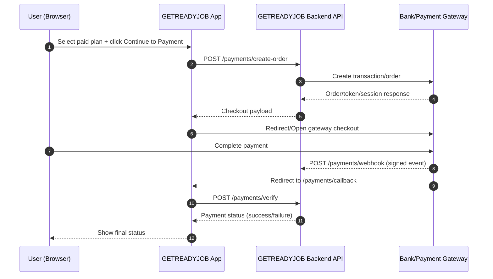

# GETREADYJOB Bank + Ads Submission Packet (V1.1)

Prepared date: 2026-07-25
Environment: Production
Website: https://getreadyjob.com
API base: https://api.getreadyjob.com/api/v1

## 1) Payment API Endpoints (For Bank/Gateway Team)

Use these URLs for integration approval and technical mapping:

- Create Order (server-to-server):
  - POST https://api.getreadyjob.com/api/v1/payments/create-order
- Verify Payment (server-to-server):
  - POST https://api.getreadyjob.com/api/v1/payments/verify
- Webhook Receiver (gateway to your backend):
  - POST https://api.getreadyjob.com/api/v1/payments/webhook
- Redirect/Callback URL (gateway redirect after payment):
  - https://api.getreadyjob.com/api/v1/payments/callback
- Cancel URL:
  - https://api.getreadyjob.com/api/v1/payments/cancel

Current status in app config:
- Active gateway: not finalized
- Supported gateways list: currently empty in runtime defaults

## 2) Payment Flow (Approval Diagram)

## 3) Mandatory Security Notes (Bank-Facing)

- Keep all secret keys only on backend:
  - Razorpay key_secret, webhook_secret
  - Stripe secret_key, webhook_secret
  - PayPal client_secret
  - CCAvenue working_key/access_code
- Never embed gateway secret keys in Flutter/web frontend bundles.
- Validate webhook signatures on every webhook request before processing.
- Use idempotency checks to prevent duplicate webhook processing.
- Log only masked transaction details (no sensitive card/account data).
- Enforce HTTPS-only communication for all callback/webhook endpoints.
- Implement request timeout + retry strategy on backend API calls.

## 4) Ads Keys (Current State)

Current values in app configuration:

- AdMob App ID: ca-app-pub-xxxxxxxxxxxxxxxx~yyyyyyyyyy (placeholder)
- AdMob Banner ID: ca-app-pub-3940256099942544/6300978111 (Google test ID)
- AdMob Interstitial ID: ca-app-pub-3940256099942544/1033173712 (Google test ID)
- AdMob Rewarded ID: ca-app-pub-3940256099942544/5224354917 (Google test ID)
- Facebook Ads IDs: placeholder values
- MoPub ID: placeholder value

Important:
- Replace test/placeholder ad IDs with live ad unit IDs from your ad dashboard before monetization launch.
- Keep server-side controls for ad frequency/targeting policy where possible.

## 5) What To Send to Bank/Gateway Team

Share only this data set:

- Company website: https://getreadyjob.com
- API base URL: https://api.getreadyjob.com/api/v1
- Create order URL: https://api.getreadyjob.com/api/v1/payments/create-order
- Verify URL: https://api.getreadyjob.com/api/v1/payments/verify
- Webhook URL: https://api.getreadyjob.com/api/v1/payments/webhook
- Callback URL: https://api.getreadyjob.com/api/v1/payments/callback
- Cancel URL: https://api.getreadyjob.com/api/v1/payments/cancel
- Support email: hello@getreadyjob.com

Do not send secret keys by email or chat. Exchange secrets only through secure credential channels.

## 6) Auto Backup + Safe Ops (Current)

- Local scheduled backup: JOBREADY_Daily_Backup (daily 21:00)
- Local backup folder: C:\JobReadyIndia\jobready_india\backups
- OneDrive backup folder: C:\Users\Avita\OneDrive\JobReadyIndia_Backups
- Latest OneDrive freeze snapshot:
  - C:\Users\Avita\OneDrive\JobReadyIndia_Backups\jobready_india_20260725_213128_c2ba746.zip

## 7) Readiness Checklist Before Going Live with Payments/Ads

- [ ] Set active payment gateway in runtime config/backend
- [ ] Add real gateway credentials in secure backend secret store
- [ ] Add webhook signature verification and replay protection
- [ ] Replace ad test IDs with production IDs
- [ ] Run one full payment success/failure/refund test cycle
- [ ] Confirm callback + webhook logs in production monitoring
- [ ] Confirm daily backup + OneDrive sync health
